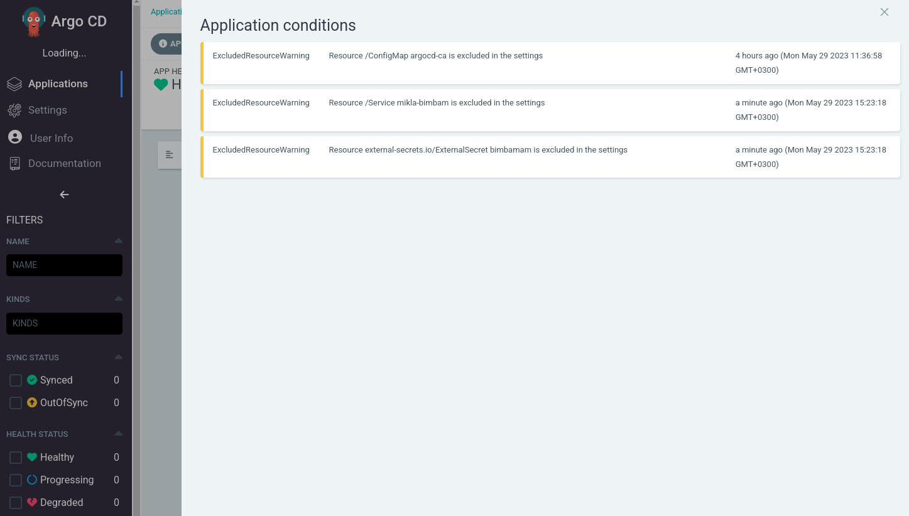
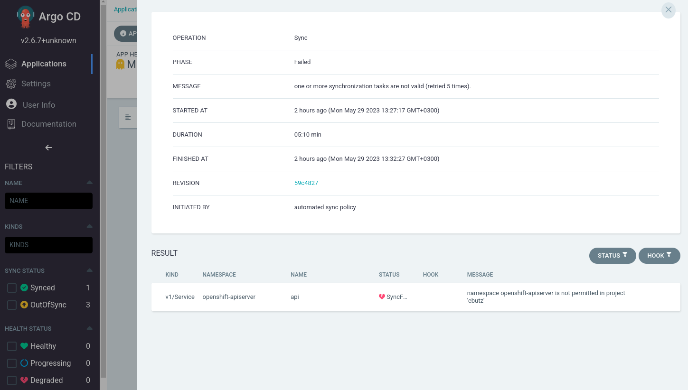
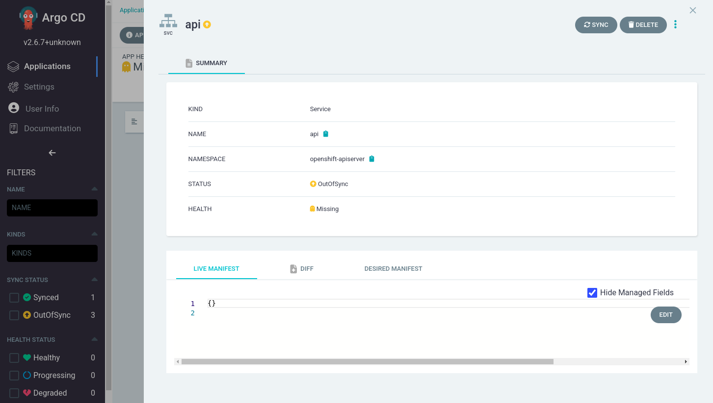
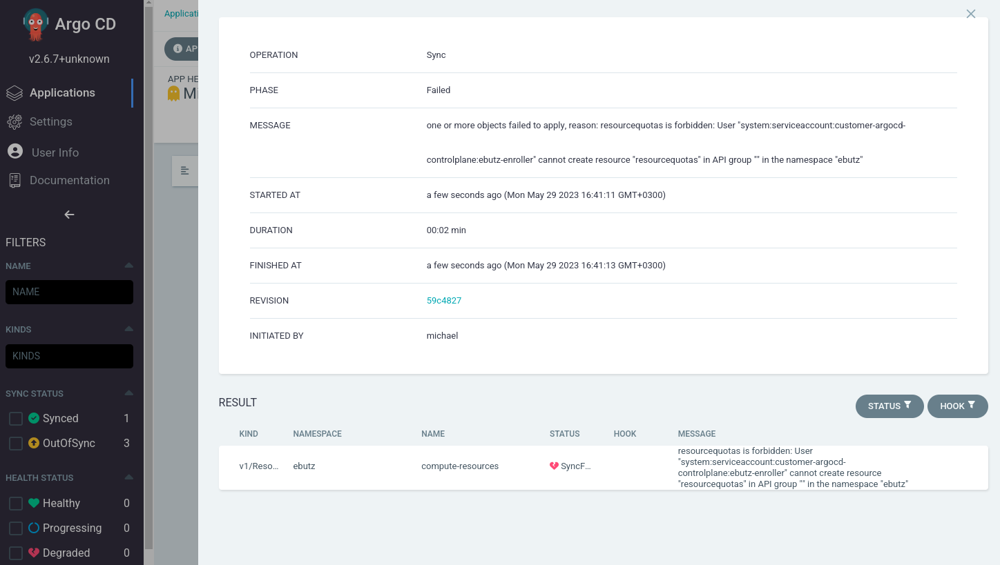

# ArgoCDaaS

This repository describes a proposal for an ArgoCD as a Service implementation in multicluster environments.

## Goal

Allow developers to maintain an automatic CD process in a multicluster environment by using ArgoCD.

1. The solution provides an ArgoCD instance for each development team that has to deploy manifests on multiple clusters.
2. The solution allows developers to leverage ArgoCD features to scale automatically across the environment (ApplicationSets).
3. The solution is distributable and can be recreated for an unlimited number of development teams.
4. The solution is not affected by other applications or other "noisy neighbours" in the environment.
5. The solution enforces a strict RBAC policy that disallows developers from accessing or editing resources outside of the project's scope.

### ArgoCDaaS Consumption Process Overview

## RBAC

This section describes RBAC scenarios addressed by the solution.

### Scenario 1 - User can not deploy workload on in-cluster

The solution only allows the creation of applications and applicationsets on in-cluster in the \<application name> namespace.

If a user tries to deploy cluster-wide resources or applications / applicationsets in other namspaces, the request will be denied by a combination of RBAC policies at [ArgoCD spec.resourceInclusions](argocd-server/templates/argocd.yaml) and [AppProject spec.destinations](argocd-server/templates/appproject.yaml).

Whenever a user tries to deploy resources at in-cluster, it receives the next error -

### Scenario 2 - User can not view sensitive workload on in-cluster

The solution only allows to view the applications and applicationsets on in-cluster in the \<application name> namespace.

If a user tries to view cluster-wide resources or namespaced resources in other namspaces, the request will be denied by a combination of RBAC policies at [ArgoCD spec.resourceInclusions](argocd-server/templates/argocd.yaml) and [AppProject spec.destinations](argocd-server/templates/appproject.yaml).

Whenever a user tries to view resources at in-cluster, it receives the next error -

### Scenario 3 - User can not deploy workload outside of the application namespace on managed cluster

The solution only allows creation of resources in the designated \<application name> namespace on the managed cluster.

If a user tries to create cluster-wide resources or namespaced resources in other namspaces on the managed cluster, the request will be denied by RBAC policies at [AppProject spec.clusterResourceWhitelist](argocd-server/templates/appproject.yaml) and [AppProject spec.destinations](argocd-server/templates/appproject.yaml).

The user is able to provision resources at the \<application name> namespace thanks to the [RoleBinding](argocd-consumer/templates/rolebinding.yaml) resource associated with ArgoCD's service account on the managed cluster.

Whenever a user tries to deploy resources outside of the \<application name> namespace scope, it receives the next error -

### Scenario 4 - User can not view sensitive workload outside of the application namespace on managed cluster

The solution only allows viewing resources in the designated \<application name> namespace on the managed cluster.

If a user tries to view cluster-wide resources or namespaced resources in other namspaces on the managed cluster, the request will be denied by RBAC policies at [AppProject spec.clusterResourceWhitelist](argocd-server/templates/appproject.yaml) and [AppProject spec.destinations](argocd-server/templates/appproject.yaml).

Whenever a user tries to view resources outside of the \<application name> namespace scope, it receives the next error -

Note that the live manifest can not been seem when viewing the resource tab in the web interface -

### Scenario 5 - User can not create sensitive namespaced resources inside the application namespace on managed cluster

The solution disallows the creation of sensitive resources (ResourceQuota, NetworkAttachmentDefinition, etc.) in the designated \<application name> namespace on the managed cluster.

If a user tries to create sensitive resources in the \<application name> namespace on the managed cluster, the request will be denied by RBAC policies at [RoleBinding](argocd-consumer/templates/rolebinding.yaml).

Whenever a user tries to create sensitive resources in the <application name> namespace, it receives the next error -

Note that even though the Kubernetes API server disallows the creation of the resource, the user may still view the live resource contents (only applies to resources in the \<application name> namespace).

