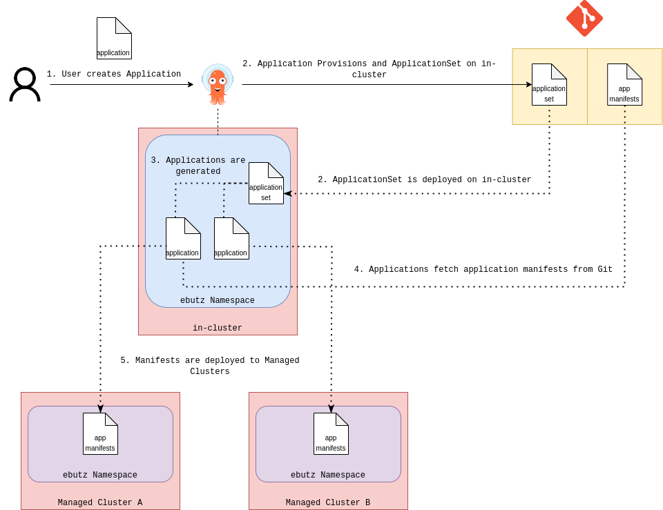

# ArgoCDaaS

This repository describes a proposal for an ArgoCD as a Service implementation in multicluster environments.

## Goal

Allow developers to maintain an automatic CD process in a multicluster environment by using ArgoCD.

1. The solution provides an ArgoCD instance for each development team that has to deploy manifests on multiple clusters.
2. The solution allows developers to leverage ArgoCD features to scale automatically across the environment (ApplicationSets).
3. The solution is distributable and can be recreated for an unlimited number of development teams.
4. The solution is not affected by other applications or other "noisy neighbours" in the environment.
5. The solution enforces a strict RBAC policy that disallows developers from accessing or editing resources outside of the project's scope.

### ArgoCDaaS Consumption Process Overview

